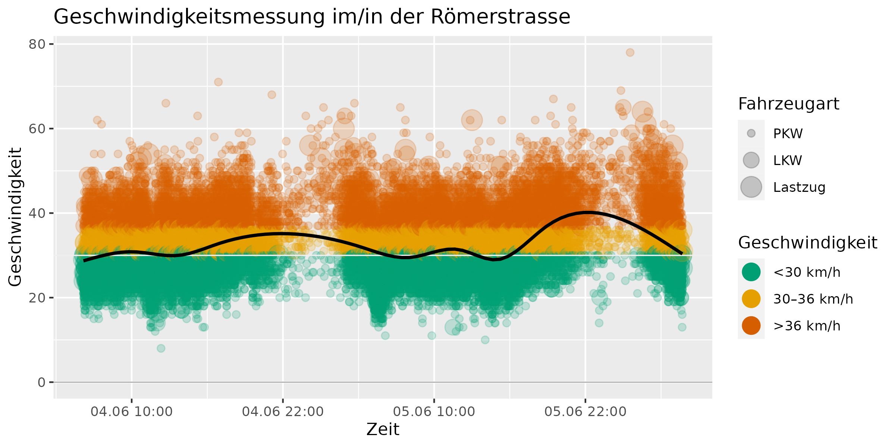

# MoerserTempo

Ich habe den Code vom Originalrepo vom letzten Jahr etwas angepasst, die Ordnerstruktur geändert und die aktuellen Daten von **2021** in dem Ordner `data/verkehrszaehlung_2021` herunter geladen.

Link zum Originalrepo von Stefan Kaufmann und @gruenzeug Juliane Wessalowski: 
https://github.com/UlmApi/MoerserTempo 

## Potentielle Aufgaben für den #oddmo22 

* Herausfinden, wie man die im Ordner `data/verkehrszaehlung_2021` automatisiert über das CKAN Moers herunterlädt und eventuell ein Tutorial dafür schreiben https://www.offenesdatenportal.de/dataset/verkehrszahlung-in-moers-2021
* Die aktuellen Straßendaten aus `data/verkehrszaehlung_2021` von 2021 mit ggplot visualisieren
* Karte und Webseite im Ordner `/messstellen_2017` mit den aktuellen Straßendaten (es sind einige mehr) updaten 
* Bennennung der plots in Funktionen verpacken, statt plot-Titel und plot-Dateien einzeln benennen zu müssen
* `facet_wrap()`-Plots erstellen, um die Daten zu vergleichen
* Verkehrsaufkommen prä-Corona und post-Corona vergleichen

## Tools

* R
* ggpplot2
* tidyverse

## ToDos 2019

 * Lesbarkeit bei Straßen mit wenig Verkehrsaufkommen verbessern
 * Y-Achsenbeschriftung anpassen

## Lizenz

 Dieses Werk ist lizenziert unter einer <a rel="license" href="http://creativecommons.org/licenses/by/4.0/">Creative Commons Namensnennung 4.0 International Lizenz</a>.
